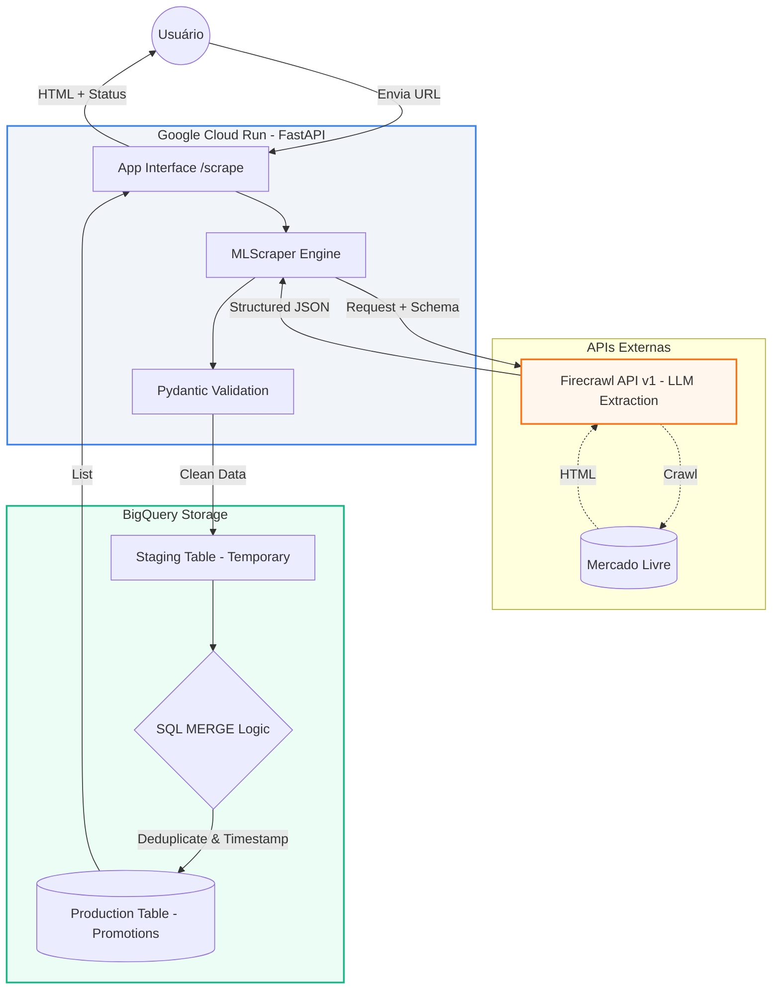
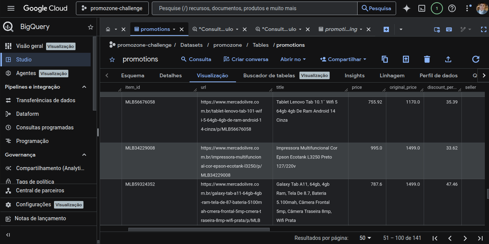

# 🚀 Promozone Challenge: Inteligência em Monitoramento de Preços

Este projeto é um pipeline de dados *end-to-end* desenvolvido para o desafio técnico **Promozone**. O sistema realiza a coleta automatizada, normalização via IA, deduplicação em Data Warehouse e disponibilização dos dados através de uma interface web moderna.

**Link do Projeto Online:** [https://promozone-service-619130145471.us-central1.run.app/](https://promozone-service-619130145471.us-central1.run.app/)

---

## 💡 Exemplos de Uso (URLs de Categorias)

O sistema foi otimizado para processar páginas de categorias do Mercado Livre. Para testar, você pode utilizar URLs como:

* **Celulares:** `https://www.mercadolivre.com.br/c/celulares-e-telefones`
* **Saúde:** `https://www.mercadolivre.com.br/c/saude`
* **Eletrodomésticos:** `https://www.mercadolivre.com.br/c/eletrodomesticos`

---

## 🏗️ Arquitetura e Tech Stack

O sistema foi desenhado para ser resiliente e escalável, utilizando tecnologias de ponta:

* **Backend:** FastAPI (Python 3.12) para alta performance e tipagem forte.
* **Extração de Dados:** [Firecrawl](https://firecrawl.dev) utilizando IA para extração estruturada de HTML dinâmico.
* **Persistência:** Google BigQuery (Data Warehouse) com arquitetura de *Staging Table*.
* **Containerização:** Docker para garantir paridade entre os ambientes de desenvolvimento e produção.
* **Cloud & Infra:** Google Cloud Run (Serverless) com deploy automatizado e escalabilidade automática.
* **Frontend:** HTML5 + Tailwind CSS para uma interface responsiva e limpa.

---

### Diagrama do Projeto


---

## 🌟 Diferenciais da Engenharia

### 1. Deduplicação Inteligente (MERGE Strategy)
Diferente de sistemas que apenas acumulam dados, este projeto utiliza uma estratégia de **Deduplicação Defensável**. Criamos uma `dedupe_key` composta e utilizamos o comando `MERGE` do BigQuery. Isso garante que o mesmo produto, com o mesmo preço, não gere redundância, mantendo a integridade do histórico de ofertas.

### 2. Autenticação Híbrida (Zero Trust)
O sistema implementa **Application Default Credentials (ADC)**. Ele detecta automaticamente se está rodando localmente (buscando o arquivo `google-credentials.json`) ou na nuvem (utilizando **IAM Roles** nativas do GCP). Isso elimina o risco de vazamento de chaves privadas dentro da imagem Docker.

### 3. Extração Estruturada via LLM
O scraper não depende de seletores CSS frágeis que quebram com mudanças de layout. Utilizamos Schemas JSON injetados na API de extração, forçando a IA a retornar dados limpos e tipados diretamente para nossos modelos **Pydantic**.

---

## 🚀 Como Executar o Projeto
1. Configuração das Variáveis de Ambiente
O projeto depende de chaves externas para funcionar. Crie um arquivo chamado .env na raiz do projeto com as seguintes definições:

```Bash

# Chave da API do Firecrawl (Obtenha em firecrawl.dev)
FIRECRAWL_API_KEY=fc-your-key-here

# Configurações do Google Cloud Platform
GCP_PROJECT_ID=promozone-challenge
GCP_DATASET_ID=promozone
```

2. Credenciais do Google Cloud (Apenas para Local)
Para rodar fora da nuvem (Local ou Docker local), você precisará de uma chave de conta de serviço:

Gere um arquivo JSON de Service Account no Console do GCP com a permissão BigQuery Admin.

Renomeie o arquivo para google-credentials.json e coloque-o na raiz do projeto.

Atenção: Este arquivo deve ficar no .gitignore e não deve ser commitado.

3. Execução Local (Python)
Ideal para desenvolvimento e testes rápidos:

```Bash

# Clone e entre na pasta
git clone https://github.com/Giuliohbb/Promozone-Challenge
cd promozone-challenge

# Crie e ative o ambiente virtual
python3 -m venv .venv
source .venv/bin/activate  # No Windows use: .venv\Scripts\activate

# Instale as dependências
pip install -r requirements.txt

# Inicie o servidor FastAPI
uvicorn app.main:app --host 0.0.0.0 --port 8080 --reload
```


4. Execução via Docker (Container)
Para garantir que o ambiente seja idêntico ao de produção no Cloud Run:

```Bash

# Build da imagem (Lembre-se do ponto no final)
docker build -t promozone-app .

# Execução passando o arquivo .env e montando o volume das credenciais
docker run -p 8080:8080 \
  --env-file .env \
  -v $(pwd)/google-credentials.json:/app/google-credentials.json \
  promozone-app

```

---

### 📊 Query de Validação (BigQuery)
Para verificar os itens coletados nas últimas 24 horas, execute:

```SQL
SELECT 
  marketplace, 
  title, 
  price, 
  collected_at 
FROM `promozone-challenge.promozone.promotions` 
WHERE collected_at >= TIMESTAMP_SUB(CURRENT_TIMESTAMP(), INTERVAL 24 HOUR)
ORDER BY collected_at DESC;
```

--- 

### 📁 Estrutura do Projeto
app/main.py: Pontos de entrada da API e rotas da interface.

app/scraper.py: Lógica de integração com a API de extração via IA(FireCrawl).

app/database.py: Gerenciamento do BigQuery, Staging e lógica de MERGE.

app/models.py: Definição dos contratos de dados via Pydantic.

templates/: Interface web desenvolvida com Tailwind CSS.

---
### Visualização dos Dados



---

### 📈 Roadmap
[ ] Gráficos de histórico de oscilação de preços.

[ ] Alertas via Webhook para quedas de preço.

[ ] Expansão para Amazon e Magalu.

---

Desenvolvido por **Giulio Henrique**